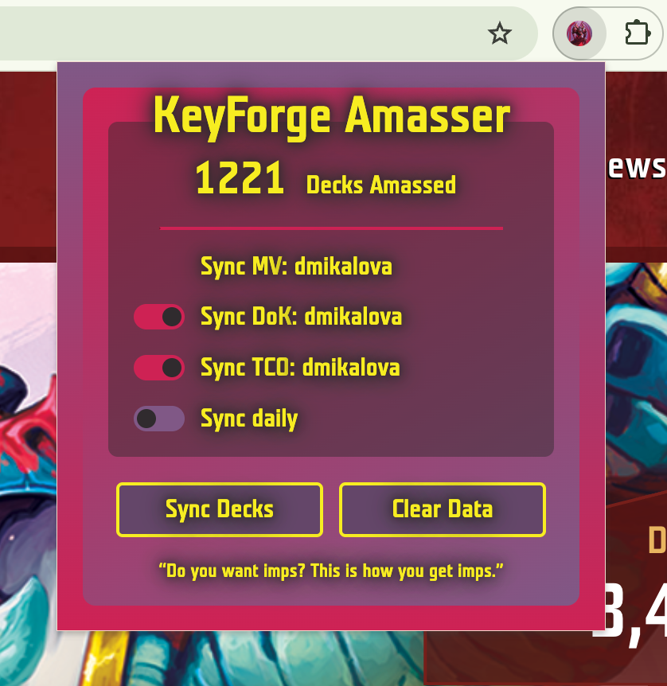

# KeyForge Amasser Browser Extension

A browser extension for Chrome and Firefox that collects KeyForge decks from the Master Vault and syncs them to Decks of KeyForge or The Crucible Online.

## Features

- The deck list is stored by the extension - after the initial sync only new decks are synced.
- Syncing happens in the background - once started the extension popup can be closed without interrupting the sync.
- Syncing can automatically run daily as long as you are logged into MV, DoK, and TCO and the browser is left open.
- It is bright enoough to be seen from space.

## Installation

1. Download the extension from the [Chrome Web Store](https://chrome.google.com/webstore/detail/keyforge-amasser/your-extension-id) or [Firefox Add-ons](https://addons.mozilla.org/en-US/firefox/addon/keyforge-amasser/).

## Permissions

The extension requests the following permissions:

- `storage`: For saving collected data and settings
- `activeTab`: For accessing the current tab's content
- `scripting`: For injecting content scripts
- Host permissions for target KeyForge websites

## Privacy

- All data is stored locally in your browser
- Data is only transmitted from Master Vault to Decks of KeyForge or The Crucible Online
- Data can be cleared by the user

## Contributing

1. Fork the repository
2. Create a feature branch
3. Make your changes
4. Test with both Chrome and Firefox
5. Submit a pull request
